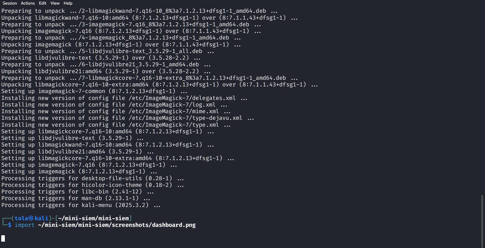

# Mini-SIEM


A lightweight **Security Information and Event Management (SIEM)** prototype built in Python.  
Mini-SIEM parses Linux authentication logs, detects SSH brute-force attacks, maps them to **MITRE ATT&CK** framework, generates alerts, simulates IP blocking, and displays everything in a clean Flask web dashboard.

  
*(Live detection example – see screenshots folder for more)*

## Features

- Parses `/var/log/auth.log` style logs (or custom files)
- Detects brute-force SSH login attempts using configurable threshold
- Maps attacks to **MITRE ATT&CK**:
  - **Tactic**: Credential Access
  - **Technique**: T1110 – Brute Force
  - **Sub-technique**: T1110.001 – Password Guessing
- Real-time alerts written to log + console
- Simulated IP blocking (extendable to real iptables)
- Responsive Flask dashboard showing IP, attempt count, MITRE info, alerts & blocked IPs
- Modular design (analyzer, alerts, collector, web)

## Demo (Live)

**Live Public Demo**: https://mini-siem.onrender.com/  
*(Deployed on Render.com free tier – may sleep after inactivity, refresh to wake)*

https://github.com/user-attachments/assets/xxxx-xxxx-xxxx-xxxx-xxxx  <!-- replace with your 30-second demo video link if you upload one to GitHub or YouTube -->

## Installation & Quick Start (Local)

```bash
# 1. Clone the repository
git clone https://github.com/tola24234/mini-siem.git
cd mini-siem

# 2. Create & activate virtual environment
python3 -m venv venv
source venv/bin/activate          # Windows: venv\Scripts\activate

# 3. Install dependencies
pip install -r requirements.txt

# 4. Run the dashboard (analysis + web server)
python3 web/app.py
