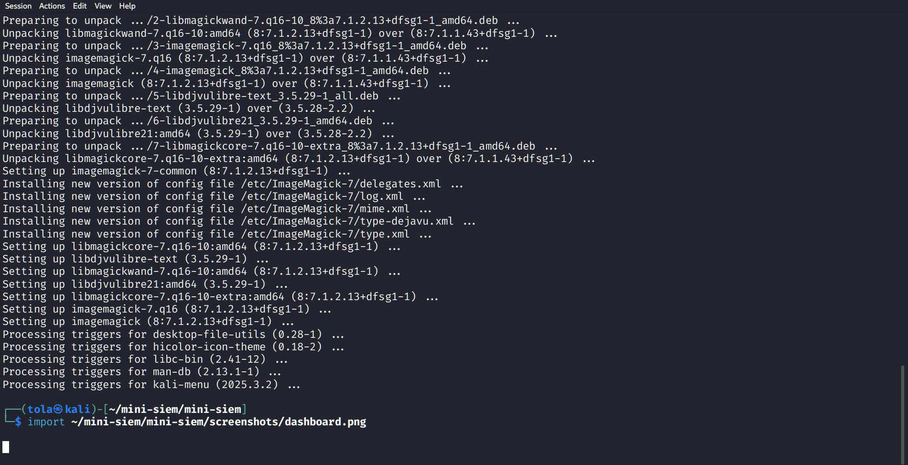

# Mini-SIEM: Real-Time Security Monitoring & Detection Engine



## Overview

Mini-SIEM is a lightweight Security Information and Event Management (SIEM) platform designed to collect security events, detect suspicious activities, generate alerts, and visualize security incidents through a dashboard.

The project demonstrates core SOC (Security Operations Center) concepts:

* Real-time log monitoring
* SSH brute-force detection
* MITRE ATT&CK mapping
* Risk scoring
* Alert database storage
* Security dashboard visualization
* Automated threat detection workflow

## Live Demo

🌐 Dashboard:

https://mini-siem.onrender.com/

### Demo Notes

* The free Render deployment may sleep after approximately 15 minutes of inactivity.
* The first page load may take 10–30 seconds.
* Refresh the dashboard to trigger demo log analysis.
* The hosted demo uses clean sample logs, so it may initially show **0 alerts**.
* To see brute-force detection locally, add failed SSH login events and run the real-time collector.

---

# Architecture

```
                 +----------------+
                 | System Logs    |
                 | SSH / Journal  |
                 +-------+--------+
                         |
                         |
                         v
              +---------------------+
              | Real-Time Collector |
              | journalctl Monitor |
              +----------+----------+
                         |
                         |
                         v
              +---------------------+
              | Detection Engine    |
              | Brute Force Rules  |
              | MITRE Mapping      |
              +----------+----------+
                         |
                         |
                         v
              +---------------------+
              | Risk Analysis       |
              | Severity Scoring   |
              +----------+----------+
                         |
                         |
                         v
              +---------------------+
              | Alert Manager       |
              | SQLite Database    |
              +----------+----------+
                         |
                         |
                         v
              +---------------------+
              | Flask Dashboard     |
              | Alert Visualization |
              +---------------------+
```

---

# Project Structure

```
mini-siem/
│
├── alerts/
│   └── alert_manager.py
│
├── collector/
│   ├── realtime_collector.py
│   └── realtime_monitor.py
│
├── engine/
│   └── detection_rules.py
│
├── models/
│   └── alert_model.py
│
├── dashboard/
│   └── app.py
│
├── analyzer/
│   ├── alert_cache.py
│   ├── bruteforce_detector.py
│   └── correlation_engine.py
│
├── instance/
│   └── siem.db
│
├── run_mini_siem.py
├── requirements.txt
└── README.md
```

---

# Installation

## 1. Clone Repository

```bash
git clone https://github.com/tola24234/mini-siem.git

cd mini-siem
```

---

## 2. Create Virtual Environment

```bash
python -m venv venv
```

Activate:

### Linux / Kali Linux

```bash
source venv/bin/activate
```

---

## 3. Install Requirements

```bash
pip install -r requirements.txt
```

Required packages include:

* Flask
* Flask-SQLAlchemy
* PyYAML
* Other SIEM dependencies

---

# Database Setup

Remove old database if needed:

```bash
rm -f instance/siem.db
```

The database will automatically store detected security alerts.

Check alerts:

```bash
sqlite3 instance/siem.db "SELECT * FROM alert;"
```

Example output:

```
1|2026-07-17|127.0.0.1|SSH Brute Force Attempt|HIGH|Detected failed SSH login attempts|T1110
```

---

# Running Mini-SIEM

## 1. Start Real-Time Security Collector

The collector monitors SSH authentication logs using journalctl.

Run:

```bash
python -m collector.realtime_monitor
```

Example:

```
🔥 Mini SIEM Real-time Monitor Started

[EVENT] sshd Failed password for invalid user fakeuser from 127.0.0.1

[FAILED LOGIN] IP=127.0.0.1 Attempts=5

🚨 SECURITY ALERT DETECTED

Attack Type : SSH Brute Force Attempt
Severity    : HIGH
MITRE ID    : T1110
Risk Score  : 70

[+] Alert saved to database
```

---

## 2. Run Dashboard

Open another terminal:

```bash
python -m dashboard.app
```

Open browser:

```
http://127.0.0.1:5001
```

Dashboard displays:

* Detected attacks
* Source IP addresses
* Severity levels
* MITRE techniques
* Alert history

---

# Detection Examples

## SSH Brute Force Detection

The SIEM detects repeated failed SSH authentication attempts.

Example attack simulation:

```bash
ssh fakeuser@127.0.0.1
```

After multiple failed passwords:

```
[FAILED LOGIN] IP=127.0.0.1 Attempts=5

🚨 SECURITY ALERT DETECTED

Attack Type : SSH Brute Force Attempt
Severity    : HIGH
MITRE ID    : T1110
Risk Score  : 70
```

---

# MITRE ATT&CK Mapping

Detected techniques:

| Attack          | MITRE ID |
| --------------- | -------- |
| SSH Brute Force | T1110    |

---

# Screenshots

## Dashboard


```
screenshots/dashboard.png
```

Example:


---

# Technologies Used

* Python
* Flask
* Flask-SQLAlchemy
* SQLite
* Linux journalctl
* SSH monitoring
* MITRE ATT&CK Framework
* Git & GitHub

---

# Future Improvements

Planned features:

* Email alert notifications
* IP reputation checking
* More attack detection rules
* User authentication
* Docker deployment
* Machine learning anomaly detection
* Full SOC dashboard metrics

---

# Author

**Tola Feyisa**

Cybersecurity Student | Security Researcher

GitHub:

https://github.com/tola24234

---

# License

This project is for educational and cybersecurity research purposes.
